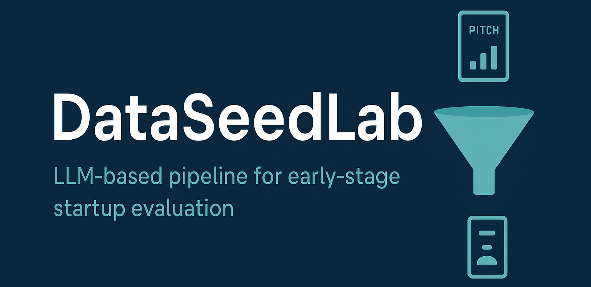

# DataSeedLab

**RAG + LLM pipeline for early-stage startup evaluation**

DataSeedLab is an experimental framework designed to support **venture capital decision-making** in the **seed and pre-seed stages**, where information is scarce, noisy, and highly subjective.  
The project leverages **Retrieval-Augmented Generation (RAG)** and **Large Language Models (LLMs)** to extract, structure, and analyze both **qualitative signals** (e.g., pitch decks, onboarding sheets) and **quantitative data** (e.g., financials, market size, team composition).  

---

## Features
- **Document ingestion**: parse onboarding sheets, pitch decks, and external sources  
- **Information extraction**: use RAG + LLM prompts to structure unstructured data  
- **Feature synthesis**: build interpretable tables with startup descriptors  
- **Decision support**: provide explanations and highlight key signals for investors  

---

## Structure
- `data/` → sample datasets and onboarding sheets  
- `extractor_agent/` → prototyping and experiments  
- `src/` → main implementation of the RAG + LLM workflow  

